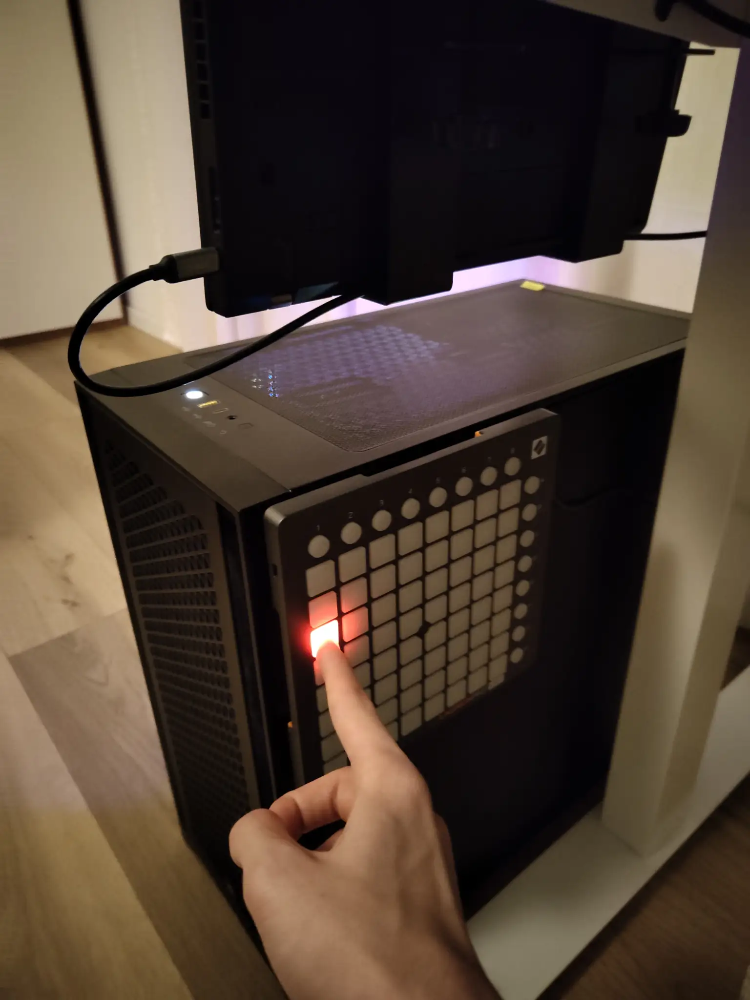

# Launchpad daemon

A simple Novation Launchpad MIDI daemon that can run scripts and stuff at button presses. It is designed to be of low impact, making use of `usleep` in the polling process, to give back computing cycles to the kernel.

It uses [ALSA development libs](https://archlinux.org/packages/extra/x86_64/alsa-lib/) and [cJson](https://github.com/DaveGamble/cJSON). A makefile is provided, and a systemd service such as:

```
[Unit]
Description=Novation Launchpad daemon

[Service]
ExecStart=/home/valerio/.local/bin/midi_listener hw:2,0,0
Restart=always
RestartSec=10

[Install]
WantedBy=default.target
```

is suggested. The MIDI address of the Launchpad can be found [with](https://archlinux.org/packages/extra/x86_64/alsa-utils/) `amidi -a`. You can get the thing compiled and runnning with `make systemd-reload`.

I'm currently using it for my [IoT server](https://github.com/iacobucci/iot-server), so it's basically just there to switch and dim my lightbulb.

